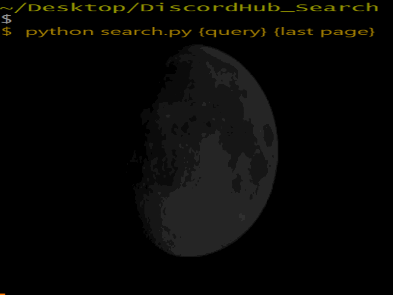

# Random-Small-Projects 

A collection of my small coding projects. Code is free to use but please mention me as the source.

## [DiscordHub Search](DiscordHub_Search/)

The user inputs what name they want to search on [DiscordHub](https://discordhub.com/) and the last page number for that query, the script then outputs the results.

## [Uncommon friends](Uncommon_friends/)

The user inputs how many friend lists they want and what names to add to them, the script then compares the lists and prints the names uncommon between the lists into a file

