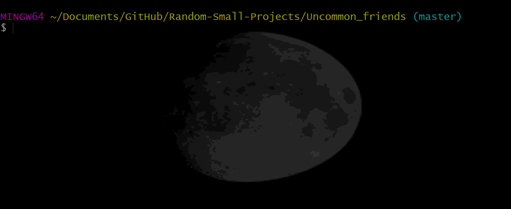
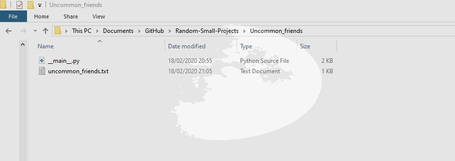

# Random-Small-Projects 
A collection of my small coding projects.

## [Uncommon friends](Uncommon_friends/)
The user inputs how many friend lists they want and what names to add to them, the script then compares the lists and prints the names uncommon between the lists into a file

